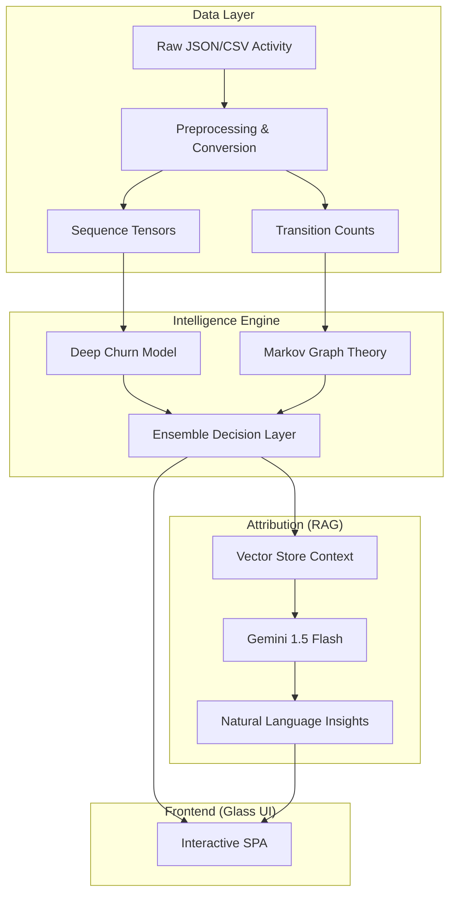

# Finspark Intelligence — Glass Feature Analytics

Finspark Intelligence is a high-fidelity, production-ready feature intelligence framework designed for lending and fintech platforms. It provides deep visibility into user behavior patterns, friction points, and churn risks through a hybrid ensemble of Markov models and BiLSTM neural sequence encoders.

## 🚀 Key Features

- **Path Integrity Discovery**: Dynamic SVG-based visualization of user journeys using Markov transition logic.
- **BiLSTM Churn Prediction**: Real-time inference of session-level churn risk with high temporal sensitivity.
- **RAG-Powered Attribution**: LLM-driven (Gemini 1.5 Flash) causal attribution for friction pathways, providing natural language insights.
- **"Glass" UI SPA**: A premium, interactive dashboard with drag-and-drop customization (SortableJS), cinematic focus modes, and live status monitoring.
- **Multimodal Visualization**: Conversion funnels, churn probability distributions, environment demographics (Pie/Polar charts), and daily trend stability metrics.

## 🏗️ Architecture



## 🛠️ Setup & Installation

### Prerequisites
- Python 3.9+
- Gemini API Key (for RAG features)

### Installation
1. Clone the repository:
   ```bash
   git clone https://github.com/ZeroDiscord/FinSpark.git
   cd FinSpark
   ```
2. Install dependencies:
   ```bash
   pip install -r requirements.txt
   ```
3. Configure environment variables in `.env`:
   ```env
   GEMINI_API_KEY=your_key_here
   API_KEY=your_internal_api_key
   ```

### Running the Dashboard
Start the production-ready FastAPI server:
```bash
python -m uvicorn api.main:app --host 0.0.0.0 --port 8000 --reload
```
Navigate to `http://localhost:8000/` to explore the Glass UI.

## 📊 API Reference

- `POST /ingest`: Upload and process raw activity logs.
- `POST /train`: Trigger per-tenant model training and RAG indexing.
- `POST /predict`: Unified ensemble prediction with causal attribution.
- `GET  /health`: System health and model registry status.

## 🛡️ Stacking Context & Design
The dashboard utilizes a sophisticated CSS layer system for its "Glass" aesthetic:
- **Z-Index 1000**: Fullscreen Focus Modals.
- **Z-Index 500**: High-Fidelity Down-Flow Tooltips.
- **Z-Index 50-80**: Sticky Navigation & Status Tickers.

---
Built by **Antigravity** for Finspark Intelligence.
