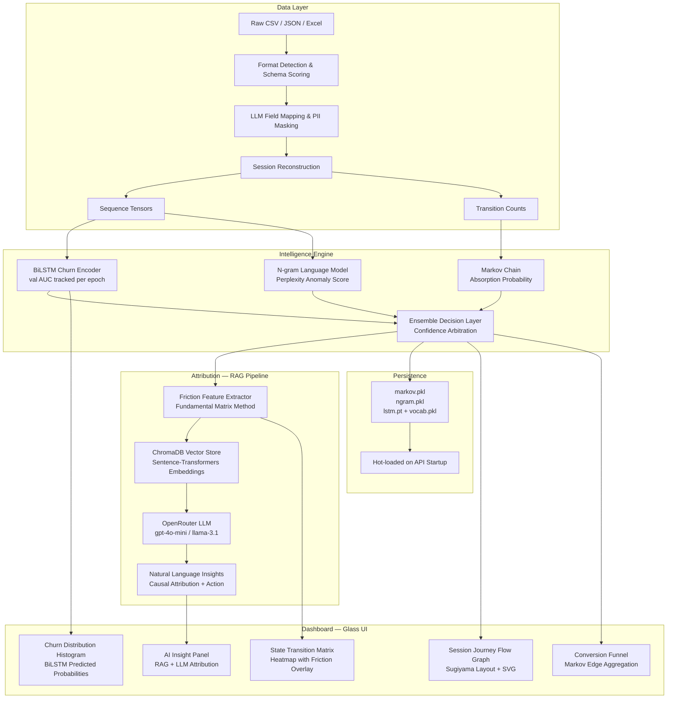

# FinSpark — Enterprise Feature Intelligence Platform

> **Turn raw lending event data into churn predictions, friction maps, and prioritized product actions — automatically.**

FinSpark is a production-ready, full-stack intelligence platform built for lending and fintech products. It detects user-facing features, reconstructs session journeys, predicts churn using a three-model ensemble, and routes recommendations directly into engineering workflows — all from a single data upload.

---

## 🧠 Why FinSpark Exists

Enterprise lending teams know users are dropping off. They don't know **which feature caused it**, **why it happened**, or **how to act fast enough**.

FinSpark closes that loop end-to-end:

```
Raw Event Data  →  Feature Detection  →  Session Reconstruction
     →  Ensemble Churn Prediction  →  Friction Attribution  →  Kanban Action
```

No manual tagging. No schema rewrites. No data science team required.

---

## ⚡ Key Differentiators

### 1. Three-Model Ensemble — Reasoning, Not Just Prediction

| Model | Role | What It Catches |
|---|---|---|
| **Markov Chain** | Journey flow integrity | Transition probability violations — "62% of users who hit `bureau_pull` go to `drop_off`" |
| **BiLSTM Encoder** | Sequential churn memory | Long-range order dependencies — the *sequence* of features, not just which ones appeared |
| **N-gram LM** | Path anomaly detection | Perplexity-based outlier sessions — unusual journeys that look normal step-by-step |

When all three agree → high confidence. When they disagree → LLM fallback is triggered automatically.

### 2. Markov Absorption Probability — Mathematically Grounded Friction

Most tools show funnel drop-off rates. FinSpark computes **forward-looking absorption probability** using the fundamental matrix method:

```
N = (I − Q)⁻¹    →    B = N · R
```

This gives you: *"A user currently at `income_verification` has a 54% probability of eventually reaching `drop_off`"* — not a historical conversion rate, but a real-time risk score per feature state.

### 3. Zero-Schema Data Ingestion

Upload any CSV, JSON, or Excel from any lending platform. The pipeline:
- Auto-detects field mapping via schema similarity scoring
- LLM-converts non-standard columns to the L1→L2→L3→L4 event hierarchy
- PII-masks sensitive fields before any processing
- Returns a match score so data quality is always visible

### 4. RAG-Powered Natural Language Attribution

The insight panel retrieves the most relevant feature context from ChromaDB and sends it to an LLM (via OpenRouter) to explain:
- Why users are churning at a specific node
- What the likely UX or product cause is
- A concrete recommended fix

The LLM knows *your product's features* — not generic advice.

### 5. Full Tracking SDK Code Generation

After feature detection, FinSpark generates production-ready instrumentation code in:

**JavaScript · React · Node.js · Python · Go · Java · Kotlin · Dart**

With the correct tenant hash, L1/L2/L3/L4 hierarchy, and timestamp formatting baked in. A developer can be fully instrumented in under 10 minutes.

### 6. Asana Kanban Integration — Signal to Action

Recommendations go directly into Asana as structured tasks: churn score, impact score, feature name, and suggested fix — no manual translation from insight to ticket.

---

## 🏗️ Architecture

### Full System Architecture

```
┌─────────────────────────────────────────────────────────────────┐
│                        FinSpark Platform                        │
│                                                                 │
│  ┌──────────────┐    ┌──────────────┐    ┌──────────────────┐  │
│  │   Frontend   │    │   Backend    │    │   ML Service     │  │
│  │  React+Vite  │◄──►│  Express.js  │◄──►│   FastAPI        │  │
│  │  Port 5173   │    │  Port 3001   │    │   Port 8000      │  │
│  └──────────────┘    └──────┬───────┘    └──────┬───────────┘  │
│                             │                   │              │
│                    ┌────────▼────────┐  ┌───────▼──────────┐   │
│                    │    MongoDB      │  │  Model Store     │   │
│                    │  (Auth, Cache,  │  │  markov.pkl      │   │
│                    │   Tenants,      │  │  lstm.pt         │   │
│                    │   Recs, Asana)  │  │  ngram.pkl       │   │
│                    └─────────────────┘  │  ChromaDB (RAG)  │   │
│                                         └──────────────────┘   │
└─────────────────────────────────────────────────────────────────┘
```

### ML Intelligence Engine Architecture



### Data Flow — Upload to Insight

```
User Upload (CSV/APK)
        │
        ▼
┌───────────────────┐
│  Format Detection │  ← Schema match score, missing field warnings
│  & LLM Conversion │  ← Remaps arbitrary columns to L1/L2/L3/L4
└────────┬──────────┘
         │
         ▼
┌───────────────────┐
│ Session Builder   │  ← Groups events by session_id, sorts by timestamp
│ PII Masker        │  ← Strips emails, phone numbers, account IDs
└────────┬──────────┘
         │
    ┌────┴──────────────────────────┐
    │                               │
    ▼                               ▼
┌──────────┐                 ┌─────────────┐
│  Markov  │                 │   BiLSTM    │
│  Chain   │                 │  + N-gram   │
│  fit()   │                 │  train()    │
└────┬─────┘                 └──────┬──────┘
     │                              │
     └──────────┬───────────────────┘
                │
                ▼
        ┌───────────────┐
        │   Ensemble    │  ← Confidence arbitration
        │   predict()   │  ← LLM fallback if confidence < threshold
        └───────┬───────┘
                │
        ┌───────┴────────┐
        │                │
        ▼                ▼
┌──────────────┐  ┌──────────────────┐
│ Dashboard    │  │  Recommendations │
│ Endpoints    │  │  Engine          │
│ /funnel      │  │  → Asana Kanban  │
│ /friction    │  └──────────────────┘
│ /sessions    │
│ /insight     │
└──────────────┘
```

---

## 🌟 Full Feature Set

### Product Intelligence
- APK and website feature detection (L1 Domain → L2 Module → L3 Feature → L4 Action)
- Tracking SDK generation for Web, Android, iOS, Python, Go, Java
- Session reconstruction and event ingestion from any format
- Multi-tenant architecture with SHA-256 cryptographic isolation

### Machine Intelligence
- **BiLSTM Churn Encoder** — bidirectional LSTM with mean-pooling, label smoothing, early stopping, AUC-ROC tracking
- **Markov Chain** — fundamental matrix absorption probability, friction feature detection, row-stochastic transition matrix
- **N-gram Language Model** — perplexity-based anomaly scoring for unusual session paths
- **Ensemble Layer** — confidence-weighted arbitration across all three models
- **RAG Attribution** — ChromaDB + sentence-transformers + OpenRouter LLM for causal insight generation
- **Streaming Training** — SSE epoch-by-epoch progress feed to the frontend

### Analytics Dashboard
- Session Journey Flow Graph (Sugiyama-style layered layout, SVG, absorption probability overlays)
- State Transition Matrix (Markov heatmap with friction severity overlay)
- Churn Probability Distribution (BiLSTM predicted probability histogram)
- Global Conversion Funnel (Markov edge aggregation by pipeline stage)
- Feature Criticality Polar Chart (churn_rate × usage_count scoring)
- Daily Conversion Trend (7-day stability with real churn rate baseline)
- Session Event Ribbons (per-session event replay with churn indicator)
- AI Insight Panel (RAG + LLM causal attribution with recommended action)
- Feature Analytics Table (sortable, searchable, color-coded churn risk)

### Execution & Integrations
- Asana OAuth integration — send recommendations directly to project Kanban
- Power BI export for enterprise reporting
- CSV/JSON pipeline for external analysis

---

## 🧱 Monorepo Structure

```
FinSpark/
├── Frontend/           React + Vite + TailwindCSS + Chart.js dashboard
│   └── src/
│       ├── pages/      IntelligencePage, RecommendationsPage, DashboardPage…
│       ├── components/ PathFlowGraph, TransitionMatrix, InsightPanel…
│       ├── hooks/      useIntelligenceData, useDashboardData…
│       └── api/        intelligence.api.js, dashboard.api.js…
│
├── Backend/            Node.js + Express API gateway
│   ├── routes/         dashboard, upload, recommend, asana, export
│   ├── services/       mlClient, cacheService, recommendationEngine
│   └── src/
│       └── database/   MongoDB models (Tenant, User, DashboardCache…)
│
├── ML/                 FastAPI ML & inference service
│   ├── api/            main.py, dashboard.py
│   ├── models/
│   │   ├── implicit/   lstm_encoder.py, markov.py, ngram.py
│   │   ├── explicit/   rag_pipeline.py, sentiment.py
│   │   └── ensemble.py
│   ├── preprocessing/  session_builder.py, cooccurrence.py, pii_masker.py
│   ├── ingestion/      detector.py, converter.py
│   └── data/
│       ├── models/     <tenant_hash>/ → markov.pkl, lstm.pt, ngram.pkl
│       └── vectorstore/ ChromaDB persistence
│
├── tracking-sdk/       Web and Android event capture SDKs
├── docker/             Nginx config and Docker Compose deployment
└── docs/               Architecture, demo script, deployment notes
```

---

## 🛠️ Tech Stack

| Layer | Technology |
|---|---|
| **Frontend** | React 18, Vite, TailwindCSS v4, Chart.js, Framer Motion, @dnd-kit, Zustand |
| **Backend** | Node.js, Express, MongoDB (Mongoose), PostgreSQL-ready, JWT auth |
| **ML** | FastAPI, PyTorch (BiLSTM), ChromaDB, Sentence-Transformers, NumPy, Pandas |
| **LLM / RAG** | OpenRouter API (GPT-4o-mini / LLaMA 3.1), ChromaDB vector store |
| **Integrations** | Asana OAuth2, Power BI export |
| **Deploy** | Docker, Docker Compose, Nginx reverse proxy |

---

## ⚡ Installation

### Option 1: Docker Compose (Recommended)

```bash
git clone https://github.com/ZeroDiscord/FinSpark.git
cd FinSpark
docker compose up --build
```

### Option 2: Manual Setup

```bash
# 1. Backend
cd Backend
cp .env.example .env        # fill in MONGO_URI, JWT_SECRET, ML_BASE_URL
npm install
npm run dev                 # runs on :3001

# 2. Frontend
cd ../Frontend
npm install
npm run dev                 # runs on :5173

# 3. ML Service
cd ../ML
cp .env.example .env        # fill in API_KEY, OPENROUTER_API_KEY
pip install -r requirements.txt
python -m uvicorn api.main:app --host 0.0.0.0 --port 8000 --reload
```

---

## 🔧 Environment Variables

**`ML/.env`**
```env
API_KEY=dev-secret-key
OPENROUTER_API_KEY=your_openrouter_key_here
```

**`Backend/.env`**
```env
MONGO_URI=mongodb://localhost:27017/finspark
JWT_SECRET=your_jwt_secret
ML_BASE_URL=http://localhost:8000
ML_API_KEY=dev-secret-key
```

---

## 🧪 Demo Setup

Seed the MongoDB demo tenants:

```bash
cd Backend
npm run seed:mongo
```

Demo credentials:

| Email | Password | Tenant |
|---|---|---|
| `ops@banka.com` | `Demo@1234` | Bank A |
| `ops@bankb.com` | `Demo@1234` | Bank B |
| `ops@bankc.com` | `Demo@1234` | Bank C |

---

## 📊 API Reference

### ML Service (port 8000)

| Method | Endpoint | Description |
|---|---|---|
| `POST` | `/ingest` | Upload and process raw activity logs |
| `POST` | `/train` | Train all models + index RAG for a tenant |
| `POST` | `/train/stream` | SSE streaming training with per-epoch metrics |
| `POST` | `/predict` | Full ensemble prediction with LLM fallback |
| `GET` | `/dashboard/funnel` | Markov transition edges for flow graph |
| `GET` | `/dashboard/churn-distribution` | BiLSTM predicted probability histogram |
| `GET` | `/dashboard/friction` | Friction features with absorption probabilities |
| `GET` | `/dashboard/feature-usage` | Per-feature usage counts and churn rates |
| `GET` | `/dashboard/transition-matrix` | Full Markov transition matrix |
| `GET` | `/dashboard/sessions` | Sample session event ribbons |
| `GET` | `/dashboard/segmentation` | 2D PCA session embeddings |
| `GET` | `/dashboard/insight` | RAG + LLM causal attribution answer |
| `GET` | `/health` | System health and model registry status |

### Backend API (port 3001)

| Method | Endpoint | Description |
|---|---|---|
| `POST` | `/api/auth/login` | JWT authentication |
| `GET` | `/api/dashboard/:tenantId/overview` | Tenant KPI overview |
| `GET` | `/api/dashboard/:tenantId/funnel` | Proxied Markov funnel data |
| `GET` | `/api/dashboard/:tenantId/insight` | Proxied RAG insight |
| `GET` | `/api/recommendations/:tenantId` | Prioritized recommendations list |
| `POST` | `/api/recommendations/:tenantId/kanban` | Send recommendation to Asana |
| `GET` | `/api/tracking/:tenantId/snippets` | Generated SDK code snippets |

---

## 🛡️ Security & Multi-Tenancy

- Every tenant identified by **SHA-256 hash** — never raw IDs in ML service
- Models, vector stores, and cached data all namespaced by tenant hash
- JWT-authenticated API gateway — ML service never exposed directly
- MongoDB dashboard cache with TTL — prevents redundant ML calls
- PII masking in preprocessing pipeline before any model sees the data

---

## 💡 Designed For

- **Hackathon judges**: Full working demo from seed to prediction in one flow
- **Enterprise buyers**: Multi-tenant isolation, Asana integration, Power BI export
- **Engineering teams**: Copy-paste SDK snippets, streaming training visibility
- **Product managers**: Plain-English AI recommendations mapped to Kanban

---

Built by **Antigravity** for FinSpark Intelligence.
